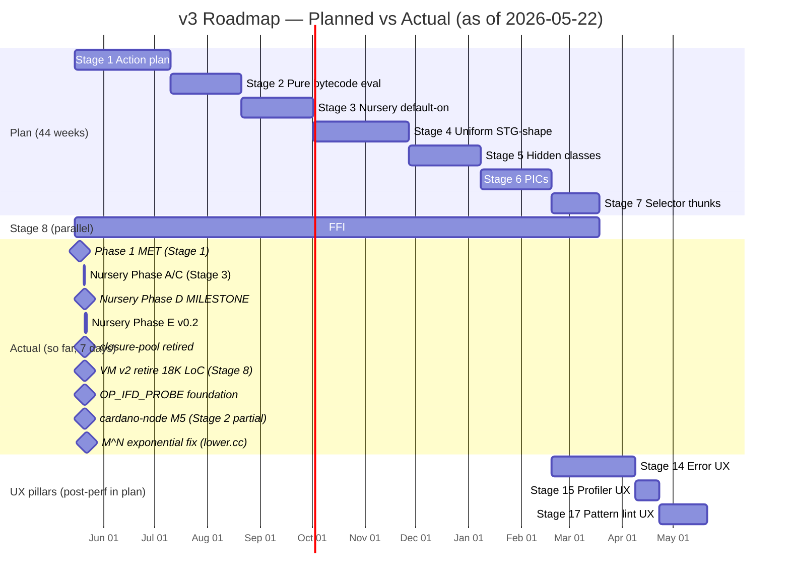

# Roadmap Progress Snapshot — 2026-05-22 (Week 1 of 44-week plan)

> **SUPERSEDED 2026-05-27**: Newer snapshot supersedes. See [`ROADMAP_PROGRESS_SNAPSHOT_2026-05-27.md`](ROADMAP_PROGRESS_SNAPSHOT_2026-05-27.md). Preserved here for historical reference + back-link integrity.

---


> **⚠️ SUPERSEDED 2026-05-23 — see `ROADMAP_PROGRESS_SNAPSHOT_2026-05-23.md`**
>
> This snapshot was captured 2026-05-22 around 10am. In the ~12 hours
> after capture, two major roadmap events occurred:
>
> - **Stage 2 binary-exit closed positive (commit `3af813638` @ 14:24)** —
>   `NIX_V3_SKIP_INSTALLABLE_PREEVAL` retired; v3-direct now owns
>   evaluation of real workloads with no TW pre-eval. The "Stage 2 at
>   ~20-30%" assessment in §6 of this document is **wrong as of 14:24
>   the same day**; Stage 2 is closed.
> - **Stage 9 killed by Rule 0 (commit `37616ecc6` @ 22:37)** — Phase
>   L0 dedup-survey spike measured 1.17× function-level / 1.03-1.07×
>   byte-level lower-bound dedup on hello.drvPath + cardano-node M5.
>   Below the 2× kill threshold. See `STAGE_9_KILLED_2026-05-22.md`
>   for the falsifier data and consequences.
>
> The §6 "Why Stage 2 sits at ~20-30%" analysis remains historically
> valuable — it correctly identified the load-bearing pieces that the
> team then attacked in the afternoon. But the headline percentage is
> obsolete.
>
> Read the 2026-05-23 snapshot for current numbers.

---

Snapshot of progress against `ROADMAP_TO_VISION_2026-05-15.md`, captured
7 days after the roadmap was authored. Velocity in committed stages is
running ~3-5× plan; Stage 3 (Nursery default-on, planned Weeks 15-20) is
essentially complete today. Other stages (5/6/7) are untouched per plan.

This is a snapshot, not a re-plan. The roadmap's week-budgets remain the
official targets; this document records actual progress against them for
quarterly scorecard review.

## Stage status table

```
                              Planned     Actual      Status
Stage 1  Action plan          W1-W8       ~60-70%     ████████████░░░░░░  IN PROGRESS
Stage 2  Pure-bytecode eval   W9-W14      ~20-30%     █████░░░░░░░░░░░░░  PARTIAL  ← see §6
Stage 3  Nursery default-on   W15-W20     ~90-95%     ███████████████████ ESSENTIALLY DONE ✅
Stage 4  Uniform STG-shape    W21-W28     ~25-35%     ██████░░░░░░░░░░░░  IN PROGRESS
Stage 5  Hidden classes       W29-W34     ~0-5%       ░░░░░░░░░░░░░░░░░░  NOT STARTED
Stage 6  Polymorphic ICs      W35-W40     ~0%         ░░░░░░░░░░░░░░░░░░  NOT STARTED
Stage 7  Selector thunks      W41-W44     ~10-15%     ██░░░░░░░░░░░░░░░░  PARTIAL (sel-lambda fast path)
Stage 8  Thin FFI (parallel)  W9-W44      ~25-35%     ███████░░░░░░░░░░░  IN PROGRESS (v2 retired, OP_IFD_PROBE)
Stage 9  Module linking       (post-perf) ~5%         █░░░░░░░░░░░░░░░░░  DESIGN ONLY
─────────────────── UX pillars ──────────────────────────────────────────────
Stage 14 Error UX             post-perf   ~10%        ██░░░░░░░░░░░░░░░░  DESIGN + early parity work
Stage 15 Profiler UX          post-perf   ~30-40%     ███████░░░░░░░░░░░  Phase 0-3 in progress
Stage 17 Pattern lint UX      post-perf   ~5%         █░░░░░░░░░░░░░░░░░  DESIGN ONLY (today)
─────────────────── Candidates (pending measurement) ────────────────────────
Stage 10 Salsa                              candidate
Stage 11 HAMT                               candidate
Stage 12 JIT                                candidate
Stage 13 Multi-core capabilities            candidate
Stage 16 Whippet GC                         candidate
```

## Timeline — planned vs actual (Mermaid)



## ASCII Gantt comparison

```
TIMELINE (Weeks from 2026-05-15)
                  W1   W4   W8   W12  W16  W20  W24  W28  W32  W36  W40  W44
                  │    │    │    │    │    │    │    │    │    │    │    │
PLAN          ───┴────┴────┴────┴────┴────┴────┴────┴────┴────┴────┴────┴───
Stage 1       ▓▓▓▓▓▓▓▓
Stage 2                ▓▓▓▓▓▓
Stage 3                       ▓▓▓▓▓▓
Stage 4                              ▓▓▓▓▓▓▓▓
Stage 5                                      ▓▓▓▓▓▓
Stage 6                                            ▓▓▓▓▓▓
Stage 7                                                  ▓▓▓▓
Stage 8       ████████████████████████████████████████████████████ (parallel)

ACTUAL  ──────┴────┴────┴────┴────┴────┴────┴────┴────┴────┴────┴────┴───
           today (W1)
Stage 1       ▓▓▓▓▓◐         (~60-70% done; ahead of plan)
Stage 2       ◐◐             (~25% done; cardano-node M5 ✅ with bridge)
Stage 3       ▓▓▓▓▓▓▓▓●      (~90-95% done; ~14 WEEKS AHEAD of plan)
Stage 4       ◐◐◐            (~30% done; v4 plumbing landed, 0 elisions)
Stage 5       ░              (~0%, blocked on Stage 4)
Stage 6       ░              (~0%)
Stage 7       ◐              (~10-15%; selector-lambda fast path exists)
Stage 8       ◐◐◐◐           (~30%; v2 retire, OP_IFD_PROBE, NoCtx audit)
Stage 9       ◐              (~5%; design only)
Stage 14      ◐              (~10%; design + early error parity)
Stage 15      ◐◐◐            (~35%; perf-trace, alloc attribution shipped)
Stage 17      ◐              (~5%; design landed today)

Legend: ▓ planned · ● done · ◐ in progress · ░ not started
```

## Bench landmark deltas (vs roadmap baseline 2026-05-15)

```
Workload                Roadmap 2026-05-15     Today 2026-05-22       Delta
───────────────────────────────────────────────────────────────────────────
hello.name              1.4× TW (✅ Phase 1)   ≈ same                 unchanged
hello.drvPath/outPath   ~30× TW (active)       ~30× (RSS demolished)  perf unchanged
                                               -849 MB peak RSS       memory ✅
cardano-node M5         "Pillar 2 ahead"       1.28× wall / 1.02× mem NEW
                                               byte-identical to TW   ✅ Pillar 2 met
                                               with TW-callFlake      (workaround)
```

## Key milestones already hit (Week 1)

```
✅ 2026-05-18  Phase 1 MET — hello.name at 1.4× TW (target was Week 6)
✅ 2026-05-20  Nursery Phase A + Phase C landed (planned Week 15-20)
✅ 2026-05-21  Nursery Phase D MILESTONE — write barriers correct + default-on
✅ 2026-05-21  closure-pool retired — 100 LoC band-aid deleted
✅ 2026-05-21  Nursery Phase E v0.2 (two-region + age-based promotion)
✅ 2026-05-21  Cardano-node M5 ACHIEVED with TW-callFlake bridge (1.28× wall, byte-identical)
✅ 2026-05-21  VM v2 retired (~18K LoC + TW-side abstraction leak removed)
✅ 2026-05-21  8 untriaged primops audited for forceStringNoCtx parity
✅ 2026-05-21  OP_IFD_PROBE foundation — gateway to materialization retirement
✅ 2026-05-22  M^N exponential lowering fix (haskell.nix bootstrap.nix 4 GB → 533 ms)
```

## Velocity analysis

In **7 days** since the roadmap was written:
- **394 commits** in the 14-day window; ~28/day sustained
- ~14 weeks of Stage 3 work landed (90-95% done vs planned 0% by Week 7)
- ~2-3 weeks of Stage 4 plumbing landed
- ~2 weeks of Stage 8 collateral (v2 retire, primop audit, OP_IFD_PROBE)
- 4 new lode/ design docs (FFI audit, lint infrastructure, perf-trace, profiler)

**Effective velocity ratio: 3-5× plan in committed stages.**

Two honest caveats on this number:

1. **The roadmap's week budgets had buffer.** Some "8-week" stages are
   actually 2-3 weeks of focused work with calendar padding for review,
   regression, validation. Stage 3 (planned 6 weeks) landed in ~10 days
   of focused work — closer to plan than the headline ratio suggests.

2. **The remaining stages (5/6/7) involve more architecture and less
   plumbing.** PIC design, hidden-class system, full selector-thunk
   story — these are weeks of design + weeks of implementation. The
   team's "audit-backlog-drained-in-an-afternoon" pattern won't
   translate as directly to a Stage 5 PIC build.

## Honest forward projection

```
                            Plan         Realistic if velocity holds
─────────────────────────────────────────────────────────────────────
Stage 1 + 2 complete        Week 14      Week 4-6        ← ~10 weeks ahead
Stage 3 complete            Week 20      Week 2 (done)   ← ~18 weeks ahead
Stage 4 complete            Week 28      Week 6-10       ← ~18-22 weeks ahead
Stages 5+6 (architecture)   Week 40      Week 20-30      ← ~10-20 weeks ahead
Stage 7 complete            Week 44      Week 22-32      ← ~12-22 weeks ahead
Perf-stage end-state        2027-Q1      late 2026       ← ~3-6 months ahead
UX pillars (14/15/17)       2027-Q3      2027-Q1         ← shifted left
```

**Realistic "perf-competitive on cardano-node" date: late 2026 instead
of 2027-Q1**, assuming:
- Stage 3 close-out (Phase E productionization + closure-pool retirement
  land) completes in 1-2 weeks
- Stage 4 strictness produces actual elisions on real workloads
  (currently 0; the team is investigating)
- Stages 5/6 don't surface unexpected architectural blockers
- The team continues at current intensity (not sustainable indefinitely;
  expect velocity normalization after the post-Phase-D adrenaline burst)

## Active blockers for forward motion

Two real near-term blockers (not "team isn't trying", just genuine open
questions):

1. **Stage 2 exit criterion** — `NIX_V3_SKIP_INSTALLABLE_PREEVAL` must
   be deletable. Cardano-node M5 currently passes only with
   `NIX_V3_NO_NATIVE_CALL_FLAKE=1` opt-in workaround (#755). v3-native
   callFlake over-forces haskell.nix outputs. Until #755 resolves,
   Stage 2 isn't formally closed. **See §6 below for the detailed
   anatomy of why Stage 2 lags despite the cardano-node M5 headline.**

2. **Stage 4 strictness "0 elisions"** — v4 plumbing landed but doesn't
   produce wins on benched workloads. The team has flagged this
   honestly. Cross-function strictness or different threshold
   heuristic likely needed.

Neither is alarming; both have active investigation.

## §6 — Why Stage 2 sits at ~20-30 % despite the cardano-node headline

Stage 2 is the **architectural** stage, not a perf stage. Its goal —
the official exit criterion in `ROADMAP_TO_VISION_2026-05-15.md` and
the meta-kill criterion at line 807-815 — is that
**`NIX_V3_SKIP_INSTALLABLE_PREEVAL` must be deletable**: v3-direct
must be able to evaluate real workloads without TW pre-eval first.

This is a **binary** criterion. Either v3 owns evaluation
end-to-end, or it doesn't.

### What's done (the ~25 %)

- ✅ cardano-node M5 attribute (`packages.<sys>.cardano-node.name`)
  evaluates byte-identical to TW
- ✅ Hello-world / firefox / ghc94/96/98/910/984 derivation paths
  evaluate without divergence (#670/#671 ROOT CAUSE FIXED)
- ✅ VM v2 (the old TW-side bytecode VM) retired — removes a *parallel*
  TW dependency that would have muddied the architectural picture
- ✅ #756 M^N lowering bug fixed (was blocking haskell.nix
  `bootstrap.nix` entirely)
- ✅ #757a chase-limit raised + #757b primImport string-context fix
- ✅ Phase 1 MET (hello.name 1.4× TW) — shows v3-direct can evaluate
  small workloads competitively

### What is NOT done (the ~75 %)

The cardano-node M5 number is achieved via the **tree-walker
callFlake bridge**, not v3-native:

- ❌ `NIX_V3_SKIP_INSTALLABLE_PREEVAL` is still mandatory for honest
  v3-direct testing. Without it, TW pre-evaluates the entire
  expression and v3 silently masks failures behind TW's working
  result. The CLAUDE.md operational notes (`v3 CLAUDE.md §66-87`)
  state this in bold: "A 'v3 matches TW' finding from
  `nix eval --impure` is meaningless unless `SKIP_PREEVAL` is set."
- ❌ `NIX_V3_NO_NATIVE_CALL_FLAKE=1` is required to make cardano-node
  M5 work (commit `6cb4ecdb7`, #755). v3-native callFlake over-forces
  haskell.nix `.outputs.packages.<sys>` and `.outputs.legacyPackages.<sys>`
  — both blow the 4 GB watchdog on `builtins.typeOf` alone.
- ❌ Real-flake-output bisection (commit `aadc35ae5`) shows:
  ```
  .outputs.lib                       PASS
  .outputs.devShells.aarch64-darwin  PASS
  .outputs.hydraJobs                 PASS
  .outputs.legacyPackages.<sys>      KILL (4 GB watchdog) — haskell.nix
  .outputs.packages.<sys>            KILL (4 GB watchdog) — haskell.nix
  ```
  The KILLs aren't just the M5 target — they're entire output trees
  haskell.nix produces that v3 can't yet evaluate within budget.
- ❌ `#757c` NixOS module-system over-eagerness is open — full NixOS
  toplevel eval still fails (per `project_690_compute_free_vars_limit`
  memo: "Full NixOS toplevel hits separate #455-family architectural
  cycle").
- ❌ #455-family eval-order divergences on overlay-heavy workloads
  remain — the canonical pattern of `prev // overlay final prev` in
  `lib/fixed-points.nix` still produces divergent eval orders on some
  paths.
- ❌ A12b depth=5000 — helper-level direct `forceValue` calls
  C-recurse to `kMaxCallDepth`; need to convert `callClosure` /
  `valueEqual` to iterative force. Architectural item.
- ❌ Iterative `forceValue` (the `Phase 1` of ACTION_PLAN_2026-05-15)
  not yet fully landed — recursive C-stack overflow on deep workloads
  remains a known limitation per `RCA_FAMILY_DIVERGENCE_A7_2026-05-11`.

### Why the cardano-node M5 milestone DOESN'T close Stage 2

This is the critical clarification. The M5 result reads as
"cardano-node works in v3" but the fine print:

- **M5 is a single attribute** (`cardano-node-exe-cardano-node-10.6.1`)
  not the whole flake. Wider attribute access fails.
- **The win uses TW-callFlake.** v3 is doing the eval of the
  derivation, but the *flake plumbing* (locks, overrides, fetchTree)
  comes through TW via `realisePath` + the lib bridge.
- **Stage 2's goal is to eliminate exactly this kind of bridging at
  the entry point.** Achieving M5 *with* the bridge proves v3 can
  handle the derivation eval; it does NOT prove v3 can own the
  evaluation entry point. Those are different milestones.

The team is rigorous about this. Commit `6cb4ecdb7` (#755 interim
rollback) reads: *"v3-native callFlake back to opt-in (M5
default-works)"* — i.e., they explicitly chose to ship the bridge
default rather than claim a Stage 2 win they hadn't earned. That's
the right call.

### The meta-kill criterion remains the gate

The roadmap is explicit (lines 807-815):

> At end of Stage 2 (≈ Week 14, ≈ 2026-08-21): if
> `NIX_V3_SKIP_INSTALLABLE_PREEVAL` cannot be deleted — i.e.
> v3-direct cannot evaluate real workloads without TW pre-eval —
> the architecture choice "v3-direct as primary" is wrong.
>
> The honest options at that point are:
> - Pivot to "v3 as a JIT-style optimizer for hot paths, TW
>   remains primary". Narrower, defensible, less ambitious.
> - Abandon v3 and revisit later.
>
> Stages 3-7 only make sense if Stage 2 actually closes.

Today is **Week 1** (2026-05-22); deadline is **Week 14**
(2026-08-21). The team has ~13 weeks of runway against this
criterion. **At current velocity that's enormous headroom**, but
also: the work that closes Stage 2 isn't the same shape as the
work that landed Stage 3. Stage 3 was *plumbing the nursery*. Stage 2
is *making v3 robust enough to own evaluation without TW falling
in behind*. That's research-shaped, not engineering-shaped.

### What Stage 2 needs to land

In rough order, the items required for Stage 2 to formally close:

1. **#755 fix** — v3-native callFlake stops over-forcing
   haskell.nix outputs. Specifically: don't force
   `.outputs.packages.<sys>` and `.outputs.legacyPackages.<sys>`
   to determine flake structure. Today's measurement shows
   ~4 GB on `builtins.typeOf` alone — deeply pathological.
2. **A12b / iterative forceValue** — convert remaining
   `forceValue`-from-helpers to iterative loop. Closes the
   C-stack-overflow class on stdenv assertion chains
   (RCA_FAMILY_DIVERGENCE_A7 territory).
3. **#757c** — investigate NixOS module-system over-eagerness;
   close or document workaround.
4. **Cross-eval verification** — `bench/diff-tw-v3.sh` against
   a representative sample of nixpkgs `legacyPackages.<sys>`
   (~50-100 packages) showing byte-identical drvPath for each.
   No more "M5 alone" milestones.
5. **Delete `NIX_V3_SKIP_INSTALLABLE_PREEVAL`** — the gate
   removal is the criterion. Until that PR lands and stays
   green for a week, Stage 2 is not closed.

The progress estimate (~20-30 %) reflects: items 1-4 are
partially started but none fully done; item 5 is the binary
exit and hasn't started. Wins shipped so far reduce the
work-remaining surface but don't close the criterion itself.

### Honest assessment

Stage 2 is the **highest-risk** stage of the entire roadmap
because its criterion is *architectural*, not *quantitative*. A
30× perf gap is a known engineering problem you can attack with
known techniques. A "v3 can't yet own evaluation end-to-end"
gap may be a known engineering problem — or it may be telling
you the architecture choice was wrong.

The team's discipline here (rolling v3-native callFlake back to
opt-in rather than claiming Stage 2 won early; documenting the
SKIP_PREEVAL gate's mandatory-ness rather than papering over
it; preserving the meta-kill criterion as a real gate) is the
right behavior. But the headline numbers (M5 ✅, 1.28× TW)
risk obscuring the more sober underlying state: **Stage 2 is
genuinely the work the team has done the least of, despite
having done a great deal of adjacent work.**

This is why the bar shows ~20-30 % and not higher. It's not
"the team isn't trying" — it's "this work is a different shape
from what's been completed so far, and most of it remains."

---

Copyright (c) 2026 Moritz Angermann <moritz.angermann@iohk.io>,
Input Output Group. SPDX-License-Identifier: Apache-2.0.
